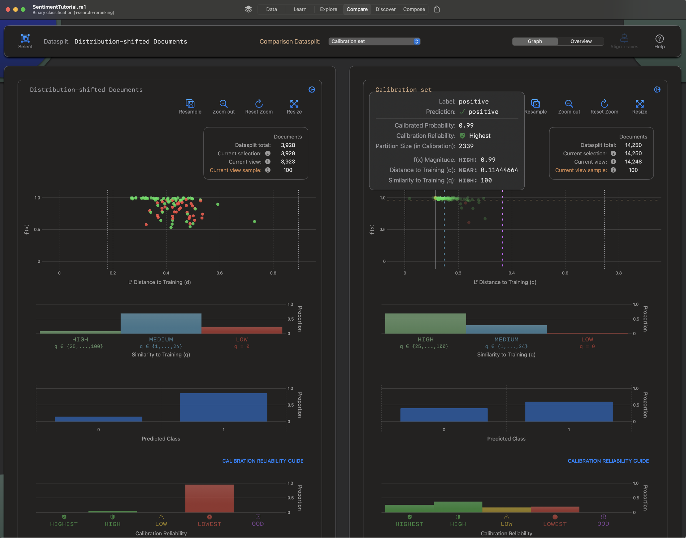

# Reexpress one

The first act of Reexpress AI was a depth-first, straight-shot effort to solve the output verification problem for models with non-identifiable parameters (a.k.a., the 'AI alignment' problem). That successfully resulted in Similarity-Distance-Magnitude Calibration, a novel decoupling of aleatoric (irreducible) uncertainty and epistemic (reducible) uncertainty. 

`Reexpress one` is a no-code, visual data analysis platform for macOS that implements these results to obtain reliable and introspectable predictions over high-dimensional inputs for the document classification setting.

[A version of this software is available on the Mac App Store here](https://apple.co/40XXpe9).

> [!TIP]
> Reexpress AI is currently extending this line of work to more complex, multi-part compound LLM systems for QA and programming tasks to streamline data science workflows, building agentic LLM systems that can search and reason with quantified uncertainty, [as described here](https://re.express/next.html). If that interests you, definitely be in touch!

## Compiling

Compilation requires XCode (last tested with Xcode Version 15), macOS 14 (Sonoma), and an Apple Silicon Mac.

Before compiling, you need to download the `.mlpackage` neural networks, which contain a fusion of a subset of weights from Flan-T5 (xl, large, and base) and mT0-base; reduction operators to mask and subset the hidden states (for training and inference, which also use the Accelerate framework's BNNS library); and an L2 distance indexer. Collectively these are about 5 GB and are [here for download](https://drive.google.com/file/d/1dVArdmZqDxiFLBjZXH77ROIdxcALeetk/view?usp=sharing). Download, unzip, and add the resulting MLModels folder to the project. (Note that the .gitignore will exclude these files from the repo.)

## Program Documentation

[Quick Start Guide](https://raw.githubusercontent.com/ReexpressAI/Documentation/main/quick_start_guide.pdf)

[Reference](https://raw.githubusercontent.com/ReexpressAI/Documentation/main/reference.pdf)

[Tutorial Series](https://github.com/ReexpressAI/Example_Data). Note that Tutorials 7 and 8 have links to pre-trained data and model `.re1` files that you can use to explore the capabilities of the software without training your own models.

## Citation

If you find this software useful, please consider citing our paper, a link to which we will post here shortly.
