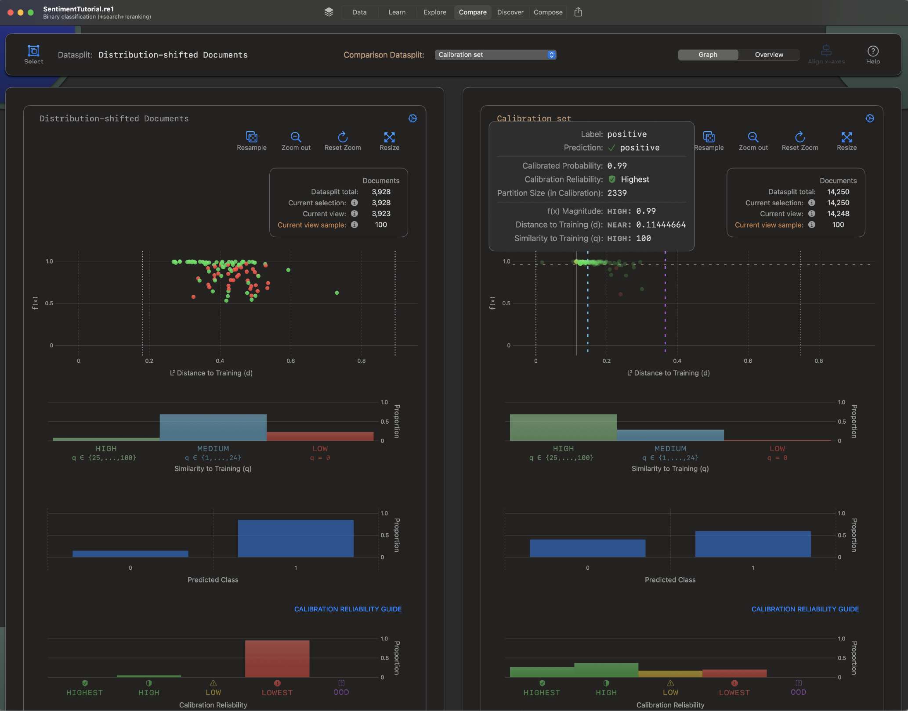

# Reexpress one

The first act of Reexpress AI was a depth-first, straight-shot effort to solve the output verification problem for models with non-identifiable parameters (a.k.a., the 'AI alignment' problem). That successfully resulted in Similarity-Distance-Magnitude Calibration, a novel decoupling of aleatoric (irreducible) uncertainty and epistemic (reducible) uncertainty. The conclusion of this line of work is available [here](https://arxiv.org/abs/2502.20167). 

`Reexpress one` was a no-code, visual data analysis platform for macOS that implemented a basic decomposition of epistemic uncertainty for classification tasks in service of our broader research program to obtain reliable and introspectable predictions over LLMs, and to study the behavior of high-dimensional objects, more generally.

> [!NOTE]
> We are no longer actively supporting `Reexpress one` and it is now a legacy offering. We include its original source code (as it existed when originally released in November 2023) and original documentation in full here, given its significance in the history of computing vis-a-vis the subsequent development of sdm activation functions, sdm estimators, and sdm networks. For current data analysis use-cases and LLM deployments, we recommend using these more recent methods.

## Compiling

Compilation requires XCode (last tested with Xcode Version 15), macOS 14 (Sonoma), and an Apple Silicon Mac.

Before compiling, you need to download the `.mlpackage` neural networks, which contain a fusion of a subset of weights from the encoder and decoder of Flan-T5 (xl, large, and base) and mT0-base; reduction operators to mask and subset the hidden states (for training and inference, which also use the Accelerate framework's BNNS library); and an L2 distance indexer. Collectively these are about 5 GB and are [here for download](https://drive.google.com/file/d/1dVArdmZqDxiFLBjZXH77ROIdxcALeetk/view?usp=sharing). Download, unzip, and add the resulting MLModels folder to the project. (Note that the .gitignore will exclude these files from the repo.)

## Program Documentation

[Quick Start Guide](https://raw.githubusercontent.com/ReexpressAI/Documentation/main/quick_start_guide.pdf)

[Reference](https://raw.githubusercontent.com/ReexpressAI/Documentation/main/reference.pdf)

[Tutorial Series](https://github.com/ReexpressAI/Example_Data). Note that Tutorials 7 and 8 have links to pre-trained data and model `.re1` files that you can use to explore the capabilities of the software without training your own models.

